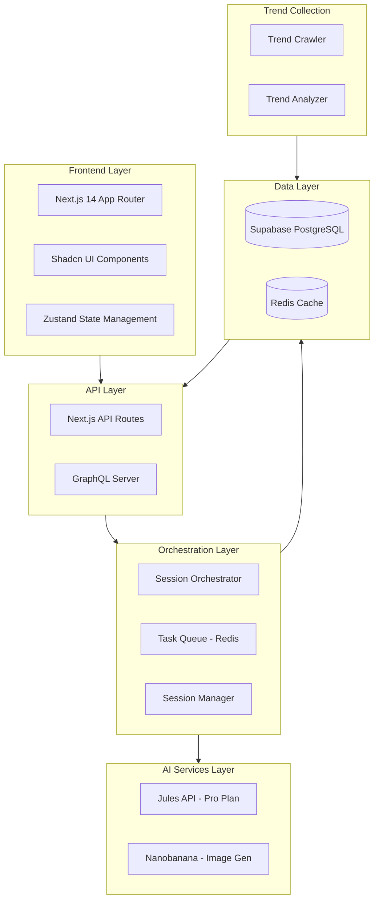
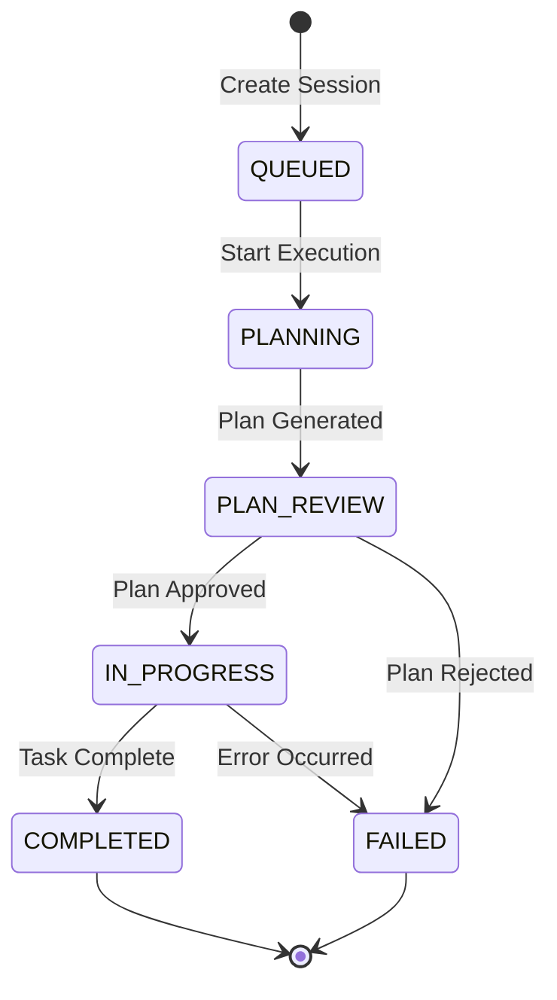
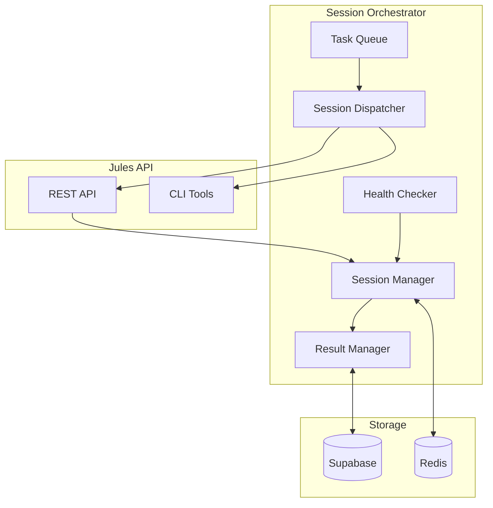

# AGENTS.md - TrendYummy AI Agent System Guide

> **Purpose**: Jules API 및 내부 AI 에이전트들에게 프로젝트 구조, 작업 가이드, 시스템 아키텍처를 제공하는 문서

---

## 1. Project Context for AI Agents

### 1.1 Project Overview & Architecture



**Framework**: Next.js 14 (App Router)
**Language**: TypeScript (Strict mode)
**State Management**: Zustand
**Styling**: Tailwind CSS + Shadcn UI
**Database**: Supabase (PostgreSQL)
**Cache**: Redis
**AI Services**: Jules API (Pro Plan), Nanobanana (Image Generation)

### 1.2 Project Goals

> **TrendYummy**: 실시간 인터넷 트렌드를 반영하여 MBTI 테스트, 레벨 테스트, 운세/궁합, 4컷 웹툰 등의 인터랙티브 웹 콘텐츠를 자동 생성 및 배포하는 시스템

**Core Capabilities**:
1. 트렌드 수집 및 분석 (뉴스, 연예, 밈/SNS)
2. Jules 세션 기반 콘텐츠 생성 (최대 100개 세션 관리)
3. 나노바나나 이미지 생성 (4컷 웹툰, 테스트 썸네일)
4. 자동화 워크플로우 (Jules Tools CLI 활용)
5. 품질 검증 및 배포 시스템

### 1.3 Jules Plan Specifications

| 플랜 | 동시 작업 수 | 일일 사용량 | 본 프로젝트 사용 |
|------|-------------|-------------|----------------|
| Free | 3 | 제한적 | ❌ 부족 |
| **Pro** | **15** | **중간** | **✅ 사용** |
| Ultra | 60 | 대용량 | ❌ 과도 |

**Session Pool Strategy (Pro Plan)**:
- **Active Pool**: 최대 15개 세션 동시 실행
- **Waiting Queue**: 최대 85개 세션 대기 (총 100개 세션 관리)
- **Session Rotation**: 완료된 세션 즉시 대기열의 다음 작업 배정

---

## 2. Coding Conventions (MUST FOLLOW)

### 2.1 Component Style

✅ **모든 컴포넌트는 함수형 컴포넌트로 작성**
✅ `src/components` 디렉토리에 위치
❌ 클래스 컴포넌트 사용 금지

```typescript
// ✅ Correct
import React from 'react';

interface UserProfileProps {
  name: string;
  age: number;
}

export const UserProfile: React.FC<UserProfileProps> = ({ name, age }) => {
  return (
    <div>
      <h2>{name}</h2>
      <p>Age: {age}</p>
    </div>
  );
};
```

### 2.2 Naming Conventions

| Type | Convention | Example |
|------|-----------|---------|
| **File names** | kebab-case | `user-profile.tsx`, `api-client.ts` |
| **Component names** | PascalCase | `UserProfile`, `ApiClient` |
| **Functions** | camelCase | `fetchUserData()`, `handleClick()` |
| **Variables** | camelCase | `userName`, `isLoading` |
| **Constants** | UPPER_SNAKE_CASE | `API_BASE_URL`, `MAX_RETRIES` |
| **Interfaces/Types** | PascalCase | `UserProfile`, `ApiResponse` |

### 2.3 Type Safety

❌ **엄격히 금지**: `any` 타입 사용
✅ **필수**: 모든 데이터는 `Interface` 또는 `Type`으로 정의

```typescript
// ❌ Wrong
const fetchData = async (): Promise<any> => {
  const data = await fetch('/api/data');
  return data.json();
};

// ✅ Correct
interface UserProfile {
  id: string;
  name: string;
  email: string;
  createdAt: Date;
}

const fetchUserProfile = async (id: string): Promise<UserProfile> => {
  const response = await fetch(`/api/users/${id}`);
  const data: UserProfile = await response.json();
  return data;
};
```

### 2.4 Directory Structure

```
src/
├── app/                    # Next.js 14 App Router
│   ├── (dashboard)/
│   │   ├── page.tsx
│   │   └── layout.tsx
│   ├── api/
│   │   ├── sessions/
│   │   │   └── route.ts
│   │   ├── tasks/
│   │   │   └── route.ts
│   │   └── webhooks/
│   │       └── jules/route.ts
│   └── layout.tsx
├── components/             # React Components
│   ├── dashboard/
│   │   ├── SessionMonitor.tsx
│   │   ├── TaskQueueView.tsx
│   │   └── ContentPreview.tsx
│   ├── ui/                 # Shadcn UI Components
│   │   ├── button.tsx
│   │   ├── card.tsx
│   │   └── dialog.tsx
│   └── layout/
│       ├── Header.tsx
│       └── Sidebar.tsx
├── lib/                    # Utility Functions
│   ├── api/
│   │   ├── jules-client.ts
│   │   └── nanobanana-client.ts
│   ├── db/
│   │   ├── supabase.ts
│   │   └── queries.ts
│   └── utils.ts
├── orchestrator/           # Jules Session Orchestration
│   ├── SessionOrchestrator.ts
│   ├── TaskQueue.ts
│   ├── SessionManager.ts
│   └── ResultManager.ts
├── types/                  # TypeScript Definitions
│   ├── jules.ts
│   ├── content.ts
│   └── trend.ts
├── hooks/                  # Custom React Hooks
│   ├── useSessions.ts
│   └── useTasks.ts
├── stores/                 # Zustand Stores
│   ├── sessionStore.ts
│   └── taskStore.ts
└── styles/
    └── globals.css
```

---

## 3. Jules API Integration Guide

### 3.1 API Authentication

```typescript
// src/lib/api/jules-client.ts
const JULES_API_KEY = process.env.JULES_API_KEY;
const JULES_API_BASE_URL = 'https://jules.googleapis.com/v1alpha';

interface JulesApiClient {
  createSession: (params: CreateSessionParams) => Promise<Session>;
  getSession: (sessionId: string) => Promise<Session>;
  listSessions: (params?: ListSessionsParams) => Promise<SessionsListResponse>;
  approvePlan: (sessionId: string) => Promise<void>;
  sendMessage: (sessionId: string, message: string) => Promise<void>;
  listActivities: (sessionId: string) => Promise<ActivitiesListResponse>;
}
```

### 3.2 Core API Endpoints

| Method | Endpoint | Description |
|--------|----------|-------------|
| POST | `/v1alpha/sessions` | Create new session |
| GET | `/v1alpha/sessions` | List all sessions |
| GET | `/v1alpha/sessions/{sessionId}` | Get session details |
| POST | `/v1alpha/{session}:approvePlan` | Approve execution plan |
| POST | `/v1alpha/{session}:sendMessage` | Send message to session |
| GET | `/v1alpha/{session}/activities` | List session activities |
| GET | `/v1alpha/sources` | List connected repositories |

### 3.3 Session Creation

```typescript
interface CreateSessionParams {
  prompt: string;                    // Required: Task description
  title?: string;                    // Optional: Session title
  sourceContext: {
    source: string;                  // e.g., "sources/github/user/repo"
    githubRepoContext?: {
      startingBranch: string;
    };
  };
  requirePlanApproval?: boolean;     // Default: false
  automationMode?: 'AUTO_CREATE_PR' | 'MANUAL';
}

// Example: Create MBTI Test Generation Session
const createMBTISession = async (trend: TrendItem): Promise<Session> => {
  const session = await julesApi.createSession({
    title: `MBTI Test: ${trend.keyword}`,
    prompt: `
      Create an MBTI personality test based on following trend:
      - Trend: ${trend.keyword}
      - Context: ${trend.description}

      Requirements:
      1. Generate 12 questions (4 choices each)
      2. Map results to 16 MBTI types
      3. Create interactive HTML/CSS components
      4. Follow project coding conventions in AGENTS.md
    `,
    sourceContext: {
      source: 'sources/github/your-org/trendyummy',
      githubRepoContext: {
        startingBranch: 'feature/mbti-test'
      }
    },
    requirePlanApproval: true,
    automationMode: 'AUTO_CREATE_PR'
  });

  return session;
};
```

### 3.4 Session Lifecycle



**Session States**:
- `QUEUED`: 세션이 대기열에 추가됨
- `PLANNING`: Jules가 실행 계획 생성 중
- `PLAN_REVIEW`: 계획 승인 대기 중
- `IN_PROGRESS`: 작업 실행 중
- `COMPLETED`: 작업 완료
- `FAILED`: 작업 실패

### 3.5 Activity Monitoring

```typescript
interface Activity {
  id: string;
  type: 'PLAN_GENERATED' | 'MESSAGE' | 'EXECUTION_COMPLETE' | 'ERROR';
  timestamp: string;
  content?: {
    plan?: Plan;
    message?: string;
    error?: ErrorDetails;
  };
}

// Poll session activities
const monitorSession = async (sessionId: string) => {
  const activities = await julesApi.listActivities(sessionId);

  for (const activity of activities.activities) {
    console.log(`[${activity.type}] ${activity.timestamp}`);

    if (activity.type === 'PLAN_GENERATED') {
      console.log('Plan generated, waiting for approval...');
    }

    if (activity.type === 'EXECUTION_COMPLETE') {
      console.log('Session completed successfully!');
    }

    if (activity.type === 'ERROR') {
      console.error('Error:', activity.content?.error);
    }
  }
};
```

---

## 4. Jules CLI Tools Integration

### 4.1 Installation

```bash
# Install Jules Tools CLI globally
npm install -g @google/jules

# Authenticate with Google account
jules login
```

### 4.2 Common Commands

| Command | Description |
|---------|-------------|
| `jules login` | Authenticate with Google account |
| `jules logout` | Log out |
| `jules version` | Show CLI version |
| `jules remote new` | Create new remote session |
| `jules remote list` | List all remote sessions |
| `jules remote status <session>` | Show session status |
| `jules remote approve-plan <session>` | Approve session plan |

### 4.3 Automation Workflows

**Bash Script: Batch Session Creation**

```bash
#!/bin/bash
# scripts/create-sessions.sh

# Configuration
REPO="your-org/trendyummy"
BRANCH="main"
NUM_SESSIONS=15

# Read trends from file
TRENDS_FILE="./data/trends.json"
TRENDS=$(cat $TRENDS_FILE)

# Create sessions in parallel
for i in $(seq 1 $NUM_SESSIONS); do
  TREND=$(echo $TRENDS | jq ".[$i-1]")
  KEYWORD=$(echo $TREND | jq -r '.keyword')

  echo "Creating session for trend: $KEYWORD"

  jules remote new \
    --repo "$REPO" \
    --branch "$BRANCH" \
    --prompt "Create MBTI test based on trend: $KEYWORD" \
    --title "MBTI Test: $KEYWORD" \
    &

done

# Wait for all background jobs
wait
echo "All sessions created!"
```

**Node.js Script: Automated Workflow**

```typescript
// scripts/automated-session-manager.ts
import { exec } from 'child_process';
import { promisify } from 'util';

const execAsync = promisify(exec);

class AutomatedSessionManager {
  async createBatchSessions(trends: TrendItem[]): Promise<void> {
    const maxConcurrent = 15; // Pro Plan limit
    const batches = this.chunkArray(trends, maxConcurrent);

    for (const batch of batches) {
      const promises = batch.map(trend =>
        this.createSessionWithCLI(trend)
      );

      await Promise.all(promises);
      console.log(`Batch of ${batch.length} sessions created`);
    }
  }

  private async createSessionWithCLI(trend: TrendItem): Promise<void> {
    const command = `
      jules remote new \
        --repo "your-org/trendyummy" \
        --branch "main" \
        --title "Content: ${trend.keyword}" \
        --prompt "${this.buildPrompt(trend)}"
    `;

    await execAsync(command);
  }

  private buildPrompt(trend: TrendItem): string {
    return `
      Create content based on this trend:
      - Keyword: ${trend.keyword}
      - Description: ${trend.description}
      - Category: ${trend.category}

      Follow coding conventions in AGENTS.md.
    `;
  }

  private chunkArray<T>(array: T[], size: number): T[][] {
    const chunks: T[][] = [];
    for (let i = 0; i < array.length; i += size) {
      chunks.push(array.slice(i, i + size));
    }
    return chunks;
  }
}
```

### 4.4 CI/CD Integration

**GitHub Actions Workflow**

```yaml
# .github/workflows/jules-sessions.yml
name: Jules Session Automation

on:
  schedule:
    - cron: '0 */2 * * *'  # Every 2 hours
  workflow_dispatch:

jobs:
  create-sessions:
    runs-on: ubuntu-latest
    steps:
      - name: Checkout repository
        uses: actions/checkout@v3

      - name: Setup Node.js
        uses: actions/setup-node@v3
        with:
          node-version: '18'

      - name: Install dependencies
        run: npm install

      - name: Install Jules CLI
        run: npm install -g @google/jules

      - name: Authenticate Jules
        env:
          JULES_AUTH_TOKEN: ${{ secrets.JULES_AUTH_TOKEN }}
        run: |
          echo "$JULES_AUTH_TOKEN" > ~/.jules-auth
          jules login --token ~/.jules-auth

      - name: Run session creation script
        env:
          JULES_API_KEY: ${{ secrets.JULES_API_KEY }}
        run: node scripts/automated-session-manager.ts
```

---

## 5. Session Orchestrator Design

### 5.1 Architecture Overview



### 5.2 Session Pool Management (Pro Plan)

```typescript
// src/orchestrator/SessionManager.ts
interface SessionPoolConfig {
  maxConcurrent: number;  // 15 for Pro Plan
  maxTotal: number;       // 100
  pollInterval: number;   // 30 seconds
}

export class SessionManager {
  private config: SessionPoolConfig = {
    maxConcurrent: 15,  // Pro Plan limit
    maxTotal: 100,
    pollInterval: 30000
  };

  private activePool: Map<string, Session> = new Map();
  private waitingQueue: PriorityQueue<Task>;

  /**
   * Get available session slots
   */
  getAvailableSlots(): number {
    return this.config.maxConcurrent - this.activePool.size;
  }

  /**
   * Register new session to active pool
   */
  async register(session: Session, taskId: string): Promise<void> {
    if (this.activePool.size >= this.config.maxConcurrent) {
      throw new Error('Session pool is full');
    }

    this.activePool.set(session.id, {
      ...session,
      taskId,
      registeredAt: new Date()
    });

    await this.persistState();
  }

  /**
   * Release session from active pool
   */
  async release(sessionId: string): Promise<void> {
    const session = this.activePool.get(sessionId);
    if (!session) return;

    this.activePool.delete(sessionId);
    await this.persistState();

    // Trigger dispatch for waiting tasks
    await this.dispatchWaitingTasks();
  }

  /**
   * Get all active sessions
   */
  getActiveSessions(): Session[] {
    return Array.from(this.activePool.values());
  }

  /**
   * Get session statistics
   */
  getStatistics(): SessionStats {
    return {
      active: this.activePool.size,
      waiting: this.waitingQueue.size(),
      available: this.getAvailableSlots(),
      total: this.config.maxTotal
    };
  }

  private async persistState(): Promise<void> {
    // Persist to Redis/Supabase
    const state = {
      active: Array.from(this.activePool.entries()),
      queue: this.waitingQueue.toArray(),
      timestamp: new Date()
    };

    await redis.set('session-pool-state', JSON.stringify(state));
  }
}
```

### 5.3 Session Dispatcher

```typescript
// src/orchestrator/SessionDispatcher.ts
export class SessionDispatcher {
  constructor(
    private sessionManager: SessionManager,
    private julesApi: JulesApiClient,
    private taskQueue: TaskQueue
  ) {}

  /**
   * Dispatch tasks to available session slots
   */
  async dispatch(): Promise<void> {
    const availableSlots = this.sessionManager.getAvailableSlots();

    if (availableSlots <= 0) {
      console.log('No available session slots');
      return;
    }

    // Get tasks from queue
    const tasks = await this.taskQueue.getNextTasks(availableSlots);

    if (tasks.length === 0) {
      console.log('No tasks in queue');
      return;
    }

    console.log(`Dispatching ${tasks.length} tasks...`);

    for (const task of tasks) {
      try {
        const session = await this.julesApi.createSession({
          title: task.goal.title,
          prompt: this.buildPrompt(task),
          sourceContext: task.execution.sourceContext,
          requirePlanApproval: task.execution.requirePlanApproval,
          automationMode: task.execution.automationMode
        });

        await this.sessionManager.register(session, task.id);
        await this.taskQueue.updateStatus(task.id, 'in_progress');

        console.log(`✅ Task ${task.id} → Session ${session.id}`);
      } catch (error) {
        console.error(`❌ Failed to dispatch task ${task.id}:`, error);
        await this.taskQueue.handleFailure(task.id, error);
      }
    }
  }

  /**
   * Build Jules prompt from task
   */
  private buildPrompt(task: TaskDefinition): string {
    let prompt = task.execution.prompt;

    // Add context about coding conventions
    prompt += `\n\nIMPORTANT: Follow all coding conventions specified in AGENTS.md`;
    prompt += `\n- Use TypeScript strictly (no 'any' types)`;
    prompt += `\n- Use functional components only`;
    prompt += `\n- Place all components in src/components/`;
    prompt += `\n- Use Tailwind CSS for styling`;

    return prompt;
  }
}
```

### 5.4 Health Checker

```typescript
// src/orchestrator/HealthChecker.ts
export class HealthChecker {
  private pollInterval: number = 30000; // 30 seconds

  constructor(
    private sessionManager: SessionManager,
    private julesApi: JulesApiClient
  ) {}

  /**
   * Start health checking loop
   */
  start(): void {
    setInterval(async () => {
      await this.checkSessions();
    }, this.pollInterval);
  }

  /**
   * Check all active sessions
   */
  private async checkSessions(): Promise<void> {
    const activeSessions = this.sessionManager.getActiveSessions();

    for (const session of activeSessions) {
      try {
        const status = await this.julesApi.getSession(session.id);

        if (status.state === 'COMPLETED') {
          await this.handleCompleted(session, status);
        } else if (status.state === 'FAILED') {
          await this.handleFailed(session, status);
        }
      } catch (error) {
        console.error(`Health check failed for session ${session.id}:`, error);
      }
    }
  }

  /**
   * Handle completed session
   */
  private async handleCompleted(session: Session, status: any): Promise<void> {
    console.log(`🎉 Session ${session.id} completed`);

    // Update task status
    await this.taskQueue.markCompleted(session.taskId, {
      pullRequestUrl: status.pullRequestUrl,
      summary: status.summary,
      artifacts: status.artifacts
    });

    // Release session slot
    await this.sessionManager.release(session.id);

    // Trigger notification
    await this.notifyCompletion(session, status);
  }

  /**
   * Handle failed session
   */
  private async handleFailed(session: Session, status: any): Promise<void> {
    console.error(`❌ Session ${session.id} failed:`, status.error);

    // Check retry logic
    const task = await this.taskQueue.getTask(session.taskId);

    if (task.retry_count < task.max_retries) {
      await this.taskQueue.requeueForRetry(session.taskId);
      console.log(`Retrying task ${session.taskId}`);
    } else {
      await this.taskQueue.markFailed(session.taskId, status.error);
    }

    // Release session slot
    await this.sessionManager.release(session.id);
  }
}
```

---

## 6. Content Generation Pipeline

### 6.1 Content Types & Templates

| Content Type | Priority | Jules Sessions | Description |
|-------------|----------|----------------|-------------|
| **MBTI Test** | HIGH | 25 | 드라마/영화 캐릭터 기반 성격 테스트 |
| **Level Test** | HIGH | 20 | 유행어/밈 레벨 테스트 |
| **Compatibility** | MEDIUM | 15 | 연예인 궁합, AI 운세 |
| **Webtoon 4-cut** | MEDIUM | 15 | 트렌드 기반 4컷 웹툰 |
| **Satire Content** | LOW | 10 | 풍자 시, 소설 |
| **Quality Review** | HIGH | 10 | 생성된 콘텐츠 검토 |
| **Backup/Maintenance** | LOW | 5 | 장애 복구, 재생성 |

### 6.2 Trend Integration

```typescript
// src/lib/trend/trend-analyzer.ts
export class TrendAnalyzer {
  /**
   * Analyze trend and recommend content type
   */
  async recommendContentType(trend: TrendItem): Promise<ContentType> {
    const { category, trendScore, relatedPersons } = trend;

    // Trend score threshold
    if (trendScore < 50) {
      return 'SATIRE_POEM'; // Low impact content
    }

    // Category-based recommendation
    if (category === 'entertainment') {
      if (relatedPersons.length > 0) {
        return 'COMPATIBILITY'; // Celebrity compatibility
      } else {
        return 'MBTI_TEST'; // Drama-based MBTI
      }
    }

    if (category === 'meme' || category === 'social') {
      return 'LEVEL_TEST'; // Slang/meme level test
    }

    if (category === 'news' && trendScore > 80) {
      return 'WEBTOON_4CUT'; // High-impact satire
    }

    return 'SATIRE_POEM'; // Default
  }

  /**
   * Generate Jules prompt from trend
   */
  generatePrompt(trend: TrendItem, contentType: ContentType): string {
    const templates: Record<ContentType, string> = {
      MBTI_TEST: this.getMBTIPromptTemplate(),
      LEVEL_TEST: this.getLevelTestPromptTemplate(),
      COMPATIBILITY: this.getCompatibilityPromptTemplate(),
      WEBTOON_4CUT: this.getWebtoonPromptTemplate(),
      SATIRE_POEM: this.getSatirePromptTemplate()
    };

    const template = templates[contentType];

    return template
      .replace('{{TREND_KEYWORD}}', trend.keyword)
      .replace('{{TREND_DESCRIPTION}}', trend.description)
      .replace('{{RELATED_KEYWORDS}}', trend.relatedKeywords.join(', '))
      .replace('{{TREND_SCORE}}', trend.trendScore.toString());
  }

  private getMBTIPromptTemplate(): string {
    return `
      Create an MBTI personality test based on this trend:
      - Trend: {{TREND_KEYWORD}}
      - Context: {{TREND_DESCRIPTION}}
      - Related Keywords: {{RELATED_KEYWORDS}}

      Requirements:
      1. Generate 12 scenario-based questions (4 choices each)
      2. Each choice should correspond to E/I, S/N, T/F, J/P
      3. Create result descriptions for all 16 MBTI types
      4. Each result should match to a character from trend
      5. Generate interactive React components following AGENTS.md conventions
      6. Use Shadcn UI components
      7. Include share functionality for results

      Output:
      - React components for test interface
      - TypeScript interfaces for data structures
      - CSS using Tailwind
      - JSON data for questions and results
    `;
  }

  private getLevelTestPromptTemplate(): string {
    return `
      Create a level test based on this trend:
      - Trend: {{TREND_KEYWORD}}
      - Context: {{TREND_DESCRIPTION}}

      Requirements:
      1. Generate 10-15 questions about slang/memes from this trend
      2. Multiple choice format (4 options)
      3. Provide explanations for correct answers
      4. Define 5-10 level results (e.g., Level 1: Novice → Level 10: Trend Master)
      5. Create interactive UI with progress tracking

      Output:
      - React components
      - Question data in JSON
      - Level result definitions
    `;
  }

  private getCompatibilityPromptTemplate(): string {
    return `
      Create a compatibility/fortune content based on this trend:
      - Trend: {{TREND_KEYWORD}}
      - Context: {{TREND_DESCRIPTION}}

      Requirements:
      1. Analyze celebrity/character from the trend
      2. Provide compatibility analysis based on:
         - Zodiac sign
         - MBTI
         - Blood type (if applicable)
         - Birth date numerology
      3. Generate fortune/advice text
      4. Create visually appealing result page

      Output:
      - React components for input and result
      - Compatibility calculation logic
      - Visual result cards
    `;
  }

  private getWebtoonPromptTemplate(): string {
    return `
      Create a 4-panel webtoon script based on this trend:
      - Trend: {{TREND_KEYWORD}}
      - Context: {{TREND_DESCRIPTION}}

      Requirements:
      1. Write a satirical 4-panel script
      2. Include dialogue and scene descriptions
      3. Generate image prompts for each panel (for Nanobanana API)
      4. Ensure appropriate tone (light satire, not offensive)

      Output:
      - Script with panel-by-panel descriptions
      - Image generation prompts
      - Character descriptions
    `;
  }

  private getSatirePromptTemplate(): string {
    return `
      Create a satirical poem or short story based on this trend:
      - Trend: {{TREND_KEYWORD}}
      - Context: {{TREND_DESCRIPTION}}
      - Trend Score: {{TREND_SCORE}}

      Requirements:
      1. Choose appropriate format (poem or short story)
      2. Maintain satirical but respectful tone
      3. Include disclaimer that content is satire
      4. Length: 500-1500 characters

      Output:
      - Content text
      - Metadata (keywords, reading time)
      - Visual presentation component
    `;
  }
}
```

### 6.3 Nanobanana Image Generation

```typescript
// src/lib/api/nanobanana-client.ts
export class NanobananaClient {
  private apiKey: string;
  private baseUrl: string = 'https://api.nanobanana.com/v1';

  constructor(apiKey: string) {
    this.apiKey = apiKey;
  }

  /**
   * Generate image for webtoon panel
   */
  async generateWebtoonPanel(prompt: string, style?: string): Promise<string> {
    const response = await fetch(`${this.baseUrl}/images/generate`, {
      method: 'POST',
      headers: {
        'Authorization': `Bearer ${this.apiKey}`,
        'Content-Type': 'application/json'
      },
      body: JSON.stringify({
        prompt: prompt,
        style: style || 'korean-webtoon, manga style, clean lines',
        aspectRatio: '1:1',
        quality: 'high'
      })
    });

    const data = await response.json();
    return data.imageUrl;
  }

  /**
   * Generate 4-panel webtoon images
   */
  async generate4CutWebtoon(panels: PanelPrompt[]): Promise<string[]> {
    const imageUrls: string[] = [];

    for (const panel of panels) {
      const imageUrl = await this.generateWebtoonPanel(panel.prompt);
      imageUrls.push(imageUrl);
    }

    return imageUrls;
  }

  /**
   * Generate test thumbnail
   */
  async generateTestThumbnail(title: string, theme: string): Promise<string> {
    const prompt = `
      Create a vibrant, eye-catching thumbnail image for a personality test.
      Title: "${title}"
      Theme: ${theme}
      Style: Modern, colorful, engaging, Korean web design
      Format: 16:9 aspect ratio
      Include: Title text, decorative elements, inviting vibe
    `;

    return await this.generateWebtoonPanel(prompt, 'modern-thumbnail');
  }
}
```

---

## 7. Build & Verification Commands

### 7.1 Installation

```bash
# Install dependencies (ONLY use npm, not yarn or pnpm)
npm install

# Verify installation
npm list --depth=0
```

### 7.2 Build

```bash
# Build for production
npm run build

# Expected output:
# ✓ Compiled successfully
# ✓ Linting and checking validity of types
```

### 7.3 Test

```bash
# Run all tests (Jest)
npm run test

# Run unit tests only
npm run test:unit

# Run integration tests
npm run test:integration

# Run E2E tests (Playwright)
npm run test:e2e

# Run tests with coverage
npm run test:coverage
```

### 7.4 Lint

```bash
# Run ESLint
npm run lint

# Fix linting errors automatically
npm run lint:fix

# Type check (TypeScript)
npm run type-check
```

### 7.5 Development

```bash
# Start development server
npm run dev

# Expected output:
# ✓ Ready in 3.2s
# ○ Local:   http://localhost:3000
```

---

## 8. Database Schema (Supabase)

### 8.1 Core Tables

```sql
-- Tasks Table
CREATE TABLE tasks (
    id UUID PRIMARY KEY DEFAULT gen_random_uuid(),
    goal_title VARCHAR(255) NOT NULL,
    goal_description TEXT,
    category VARCHAR(50) NOT NULL,

    -- Execution settings
    repository VARCHAR(255) NOT NULL,
    branch VARCHAR(100),
    prompt TEXT NOT NULL,
    source_context JSONB,
    require_plan_approval BOOLEAN DEFAULT true,
    automation_mode VARCHAR(50) DEFAULT 'AUTO_CREATE_PR',

    -- Management
    priority INTEGER DEFAULT 5,
    max_retries INTEGER DEFAULT 3,
    retry_count INTEGER DEFAULT 0,
    timeout_ms BIGINT DEFAULT 3600000,
    dependencies UUID[],

    -- Status
    status VARCHAR(50) DEFAULT 'pending',
    session_id VARCHAR(100),

    -- Timestamps
    created_at TIMESTAMP WITH TIME ZONE DEFAULT NOW(),
    updated_at TIMESTAMP WITH TIME ZONE DEFAULT NOW(),
    started_at TIMESTAMP WITH TIME ZONE,
    completed_at TIMESTAMP WITH TIME ZONE,

    -- Result
    result JSONB,
    error_message TEXT,
    pull_request_url VARCHAR(500),

    CONSTRAINT valid_status CHECK (
        status IN ('pending', 'queued', 'in_progress', 'plan_review', 'completed', 'failed', 'cancelled')
    )
);

-- Sessions Table
CREATE TABLE sessions (
    id VARCHAR(100) PRIMARY KEY,
    task_id UUID REFERENCES tasks(id) ON DELETE SET NULL,
    title VARCHAR(255),
    prompt TEXT,
    state VARCHAR(50) NOT NULL,

    -- Jules metadata
    jules_url VARCHAR(500),
    source_context JSONB,
    require_plan_approval BOOLEAN,
    automation_mode VARCHAR(50),

    -- Timestamps
    created_at TIMESTAMP WITH TIME ZONE DEFAULT NOW(),
    updated_at TIMESTAMP WITH TIME ZONE DEFAULT NOW(),

    -- Execution
    started_at TIMESTAMP WITH TIME ZONE,
    completed_at TIMESTAMP WITH TIME ZONE,

    -- Result
    plan JSONB,
    pull_request_url VARCHAR(500),
    artifacts JSONB,
    error_message TEXT,

    CONSTRAINT valid_state CHECK (
        state IN ('queued', 'planning', 'plan_review', 'in_progress', 'completed', 'failed')
    )
);

-- Activities Table
CREATE TABLE activities (
    id VARCHAR(100) PRIMARY KEY,
    session_id VARCHAR(100) REFERENCES sessions(id) ON DELETE CASCADE,
    activity_type VARCHAR(50) NOT NULL,
    timestamp TIMESTAMP WITH TIME ZONE DEFAULT NOW(),
    content JSONB,

    CONSTRAINT valid_activity_type CHECK (
        activity_type IN ('plan_generated', 'message', 'execution_complete', 'error', 'plan_approved')
    )
);

-- Trends Table
CREATE TABLE trends (
    id UUID PRIMARY KEY DEFAULT gen_random_uuid(),
    source VARCHAR(50) NOT NULL,
    category VARCHAR(50) NOT NULL,

    -- Trend information
    keyword VARCHAR(255) NOT NULL,
    title VARCHAR(500),
    description TEXT,
    related_keywords TEXT[],

    -- Scores
    trend_score INTEGER DEFAULT 0,
    sentiment_score DECIMAL(3, 2),
    viral_potential INTEGER DEFAULT 0,

    -- Source data
    source_url TEXT,
    image_urls TEXT[],
    related_persons JSONB,

    -- Timestamps
    detected_at TIMESTAMP WITH TIME ZONE DEFAULT NOW(),
    peak_at TIMESTAMP WITH TIME ZONE,
    expires_at TIMESTAMP WITH TIME ZONE,

    -- Content generation
    content_type_assigned VARCHAR(50),
    content_generated BOOLEAN DEFAULT FALSE,
    content_id UUID,

    CONSTRAINT valid_category CHECK (
        category IN ('news', 'entertainment', 'meme', 'social')
    )
);

-- Contents Table
CREATE TABLE contents (
    id UUID PRIMARY KEY DEFAULT gen_random_uuid(),
    trend_id UUID REFERENCES trends(id) ON DELETE SET NULL,
    session_id VARCHAR(100) REFERENCES sessions(id) ON DELETE SET NULL,

    -- Content type
    content_type VARCHAR(50) NOT NULL,
    title VARCHAR(500) NOT NULL,
    description TEXT,

    -- Content data
    content_data JSONB NOT NULL,
    image_urls TEXT[],

    -- Publication
    status VARCHAR(50) DEFAULT 'draft',
    published_url TEXT,
    published_at TIMESTAMP WITH TIME ZONE,

    -- Metadata
    quality_score INTEGER,
    view_count INTEGER DEFAULT 0,
    share_count INTEGER DEFAULT 0,

    -- Timestamps
    created_at TIMESTAMP WITH TIME ZONE DEFAULT NOW(),
    updated_at TIMESTAMP WITH TIME ZONE DEFAULT NOW(),

    CONSTRAINT valid_content_type CHECK (
        content_type IN ('mbti_test', 'level_test', 'compatibility', 'fortune', 'webtoon_4cut', 'satire_poem', 'short_story')
    ),
    CONSTRAINT valid_status CHECK (
        status IN ('draft', 'review', 'approved', 'published', 'rejected')
    )
);

-- Indexes
CREATE INDEX idx_tasks_status ON tasks(status);
CREATE INDEX idx_tasks_priority ON tasks(priority DESC);
CREATE INDEX idx_tasks_created_at ON tasks(created_at DESC);
CREATE INDEX idx_sessions_task ON sessions(task_id);
CREATE INDEX idx_sessions_state ON sessions(state);
CREATE INDEX idx_activities_session ON activities(session_id);
CREATE INDEX idx_activities_type ON activities(activity_type);
CREATE INDEX idx_trends_detected_at ON trends(detected_at DESC);
CREATE INDEX idx_trends_category ON trends(category);
CREATE INDEX idx_trends_content_generated ON trends(content_generated);
CREATE INDEX idx_contents_type ON contents(content_type);
CREATE INDEX idx_contents_status ON contents(status);
```

---

## 9. Monitoring & Operations

### 9.1 Key Metrics Dashboard

```typescript
// src/types/monitoring.ts
export interface SystemMetrics {
  // Session Pool Metrics
  sessionPool: {
    active: number;
    waiting: number;
    available: number;
    utilization: number; // percentage
  };

  // Task Queue Metrics
  taskQueue: {
    pending: number;
    inProgress: number;
    completed: number;
    failed: number;
  };

  // Performance Metrics
  performance: {
    avgSessionDuration: number; // milliseconds
    successRate: number; // percentage
    tasksPerHour: number;
  };

  // Content Metrics
  content: {
    totalGenerated: number;
    publishedToday: number;
    avgQualityScore: number;
  };

  // System Health
  health: {
    apiStatus: 'healthy' | 'degraded' | 'down';
    dbStatus: 'healthy' | 'degraded' | 'down';
    redisStatus: 'healthy' | 'degraded' | 'down';
  };
}
```

### 9.2 Dashboard UI Components

**SessionMonitor Component**

```typescript
// src/components/dashboard/SessionMonitor.tsx
'use client';

import { useState, useEffect } from 'react';
import { Card } from '@/components/ui/card';
import { Badge } from '@/components/ui/badge';

export function SessionMonitor() {
  const [metrics, setMetrics] = useState<SystemMetrics | null>(null);

  useEffect(() => {
    // Poll metrics every 30 seconds
    const interval = setInterval(async () => {
      const response = await fetch('/api/metrics');
      const data = await response.json();
      setMetrics(data);
    }, 30000);

    return () => clearInterval(interval);
  }, []);

  if (!metrics) return <div>Loading...</div>;

  return (
    <div className="grid grid-cols-1 md:grid-cols-2 lg:grid-cols-4 gap-4">
      <Card className="p-4">
        <h3 className="text-sm font-medium text-gray-500">Active Sessions</h3>
        <p className="text-3xl font-bold">{metrics.sessionPool.active}/15</p>
        <Badge variant={metrics.sessionPool.utilization > 80 ? 'destructive' : 'default'}>
          {metrics.sessionPool.utilization}% utilization
        </Badge>
      </Card>

      <Card className="p-4">
        <h3 className="text-sm font-medium text-gray-500">Success Rate</h3>
        <p className="text-3xl font-bold">{metrics.performance.successRate}%</p>
        <Badge variant="default">
          {metrics.performance.tasksPerHour} tasks/hr
        </Badge>
      </Card>

      <Card className="p-4">
        <h3 className="text-sm font-medium text-gray-500">Waiting Queue</h3>
        <p className="text-3xl font-bold">{metrics.sessionPool.waiting}</p>
        <Badge variant={metrics.sessionPool.waiting > 50 ? 'destructive' : 'default'}>
          {metrics.sessionPool.available} slots available
        </Badge>
      </Card>

      <Card className="p-4">
        <h3 className="text-sm font-medium text-gray-500">Content Generated</h3>
        <p className="text-3xl font-bold">{metrics.content.publishedToday}</p>
        <Badge variant="default">
          Avg Quality: {metrics.content.avgQualityScore}/100
        </Badge>
      </Card>
    </div>
  );
}
```

### 9.3 Alerting System

```typescript
// src/lib/monitoring/alerting.ts
export class AlertingSystem {
  private thresholds = {
    lowSuccessRate: 80, // percentage
    highQueueDepth: 50, // tasks
    highUtilization: 90, // percentage
    longSessionDuration: 7200000, // 2 hours in milliseconds
  };

  /**
   * Check metrics and send alerts if thresholds exceeded
   */
  async checkAlerts(metrics: SystemMetrics): Promise<void> {
    const alerts: string[] = [];

    // Success rate alert
    if (metrics.performance.successRate < this.thresholds.lowSuccessRate) {
      alerts.push(`Success rate dropped to ${metrics.performance.successRate}%`);
    }

    // Queue depth alert
    if (metrics.sessionPool.waiting > this.thresholds.highQueueDepth) {
      alerts.push(`Waiting queue depth: ${metrics.sessionPool.waiting} tasks`);
    }

    // Utilization alert
    if (metrics.sessionPool.utilization > this.thresholds.highUtilization) {
      alerts.push(`Session pool utilization: ${metrics.sessionPool.utilization}%`);
    }

    // Send alerts
    for (const alert of alerts) {
      await this.sendAlert(alert);
    }
  }

  /**
   * Send alert to Slack
   */
  private async sendAlert(message: string): Promise<void> {
    const webhookUrl = process.env.SLACK_WEBHOOK_URL;

    await fetch(webhookUrl, {
      method: 'POST',
      headers: { 'Content-Type': 'application/json' },
      body: JSON.stringify({
        text: `🚨 TrendYummy Alert: ${message}`,
        username: 'TrendYummy Bot'
      })
    });
  }
}
```

---

## 10. Agent-Specific Instructions

### 10.1 Jules Agent Instructions

When working on this project, Jules agents must follow these guidelines:

**Content Generation Tasks**:
1. Always read `AGENTS.md` before starting any task
2. Follow coding conventions strictly (TypeScript, functional components)
3. Use Shadcn UI components from `@/components/ui/`
4. Place all new components in appropriate subdirectories of `src/components/`
5. Define all data structures as TypeScript interfaces

**Testing Requirements**:
- Write unit tests for all new functions/components
- Use Jest for testing
- Achieve minimum 80% code coverage

**Code Quality**:
- Run `npm run lint` before submitting
- Fix all linting errors
- Ensure TypeScript compilation succeeds

### 10.2 Internal Agent Instructions

Each internal agent has a specific role:

| Agent | Role | Responsibilities |
|-------|------|-----------------|
| **TrendCollector** | Gather trends from APIs | Naver Search, Google Trends, Twitter API |
| **TrendAnalyzer** | Analyze trend data | Score calculation, category classification |
| **SessionDispatcher** | Assign tasks to Jules | Queue management, session allocation |
| **SessionMonitor** | Track session progress | Health checks, status updates |
| **ResultProcessor** | Handle completed sessions | Content storage, PR creation |
| **QualityReviewer** | Review generated content | Quality scoring, approval workflow |

---

## 11. Security & Best Practices

### 11.1 API Key Management

**⚠️ API 키 발급 방법**:

사용자가 Jules API 키를 발급받아야 하는 경우:
1. Jules 웹 콘솔(https://jules.google.com) 방문
2. Settings 페이지 접근
3. API Keys 섹션에서 새 API 키 생성

**개발자 설정**:
개발자는 `.env` 파일에 직접 Jules API 키를 입력하여 사용합니다.

```bash
# .env 파일 예시
JULES_API_KEY=jules_api_key_here
JULES_AUTH_TOKEN=jules_auth_token_here

# Supabase Configuration
SUPABASE_URL=your_supabase_url_here
SUPABASE_ANON_KEY=your_supabase_anon_key_here
SUPABASE_SERVICE_ROLE_KEY=your_supabase_service_role_key_here

# Redis Configuration
REDIS_URL=redis://localhost:6379
REDIS_PASSWORD=your_redis_password_here

# Nanobanana API Configuration
NANOBANANA_API_KEY=your_nanobanana_api_key_here

# Slack Webhook (Optional)
SLACK_WEBHOOK_URL=https://hooks.slack.com/services/YOUR/WEBHOOK/URL

# Next.js Configuration
PORT=3000
NODE_ENV=development
```

### 11.2 Security Guidelines

✅ **DO**:
- Use environment variables for all sensitive data
- Rotate API keys regularly
- Implement rate limiting on API endpoints
- Validate all user inputs
- Use HTTPS for all API calls

❌ **DO NOT**:
- Commit API keys to version control
- Log sensitive data
- Share API keys in plain text
- Expose database credentials

### 11.3 Prompt Injection Prevention

```typescript
// Sanitize user input before sending to Jules
function sanitizePrompt(input: string): string {
  // Remove potential injection patterns
  const sanitized = input
    .replace(/\/system\b/gi, '')
    .replace(/\/ignore\b/gi, '')
    .replace(/\/reset\b/gi, '')
    .replace(/<.*?>/g, ''); // Remove HTML tags

  // Limit length
  return sanitized.substring(0, 10000);
}
```

---

## 12. Troubleshooting

### Common Issues & Solutions

| Issue | Cause | Solution |
|-------|-------|----------|
| Session creation fails | API key invalid | Verify JULES_API_KEY in .env |
| Session timeout | Task too complex | Break down into smaller tasks |
| Build fails | Type errors | Run `npm run type-check` |
| Lint errors | Code style issues | Run `npm run lint:fix` |
| Database connection fails | Supabase URL wrong | Check SUPABASE_URL in .env |
| Images not generating | Nanobanana API error | Check NANOBANANA_API_KEY |

### Debug Commands

```bash
# Check Jules API connection
curl -H "X-Goog-Api-Key: $JULES_API_KEY" \
  https://jules.googleapis.com/v1alpha/sessions

# Check database connection
npx supabase status

# Run with verbose logging
npm run dev -- --verbose

# View Redis state
redis-cli KEYS "session-pool-state"
```

---

## References

- [Jules API Documentation](https://developers.google.com/jules/api)
- [Jules CLI Reference](https://jules.google/docs/cli/reference/)
- [Next.js 14 Documentation](https://nextjs.org/docs)
- [Supabase Documentation](https://supabase.com/docs)
- [Nanobanana API](https://nanobanana.com/docs)
- [PLAN.md](./PLAN.md)
- [TECHSPEC.md](./TECHSPEC.md)

---

**Last Updated**: 2026-01-21
**Version**: 1.0.0
**Maintainer**: TrendYummy Team
