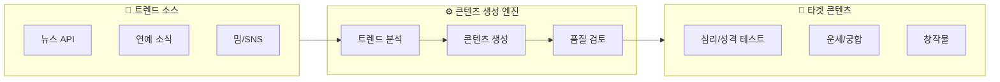
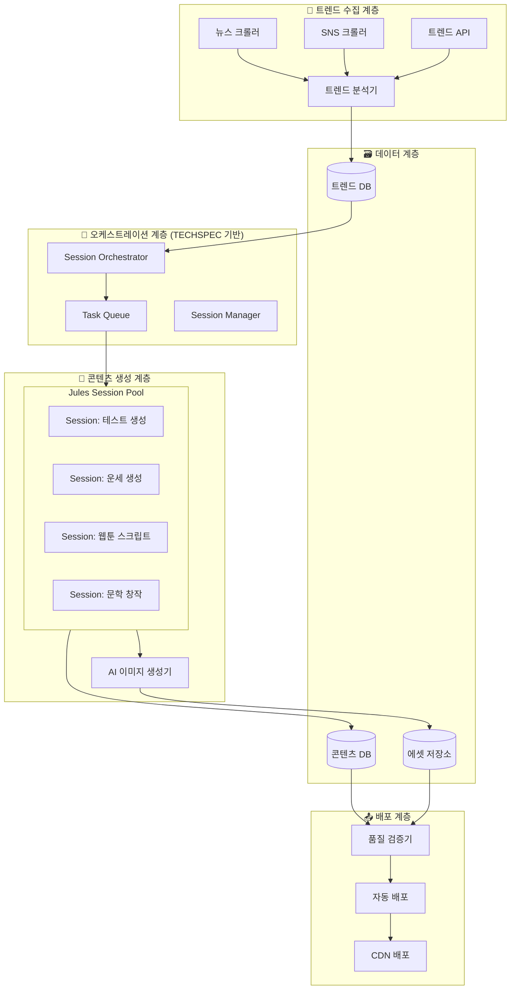
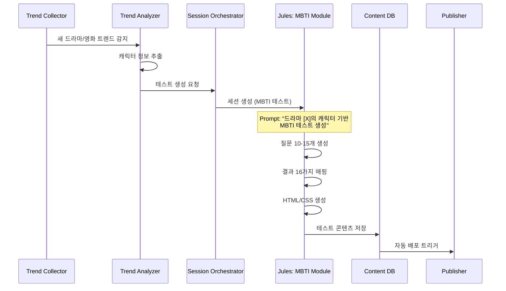
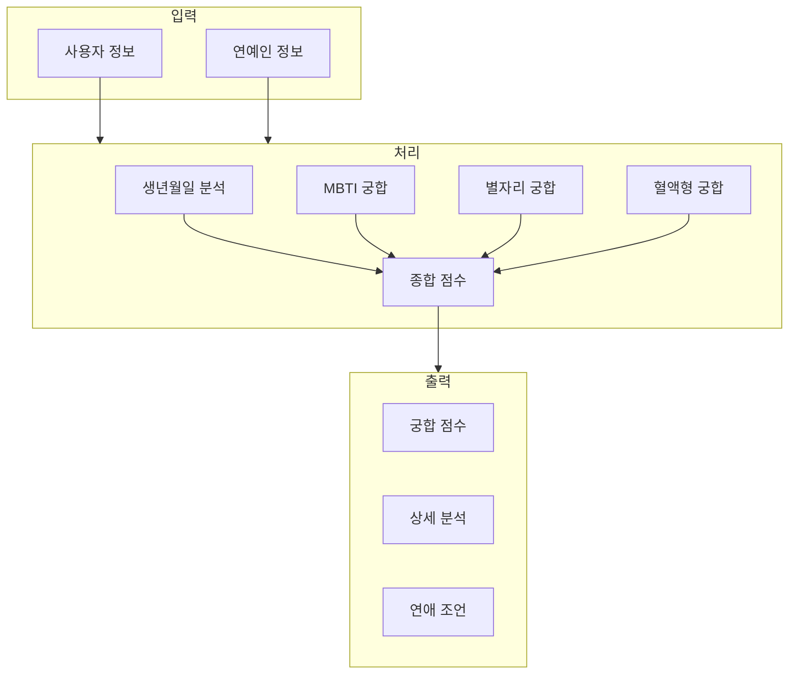
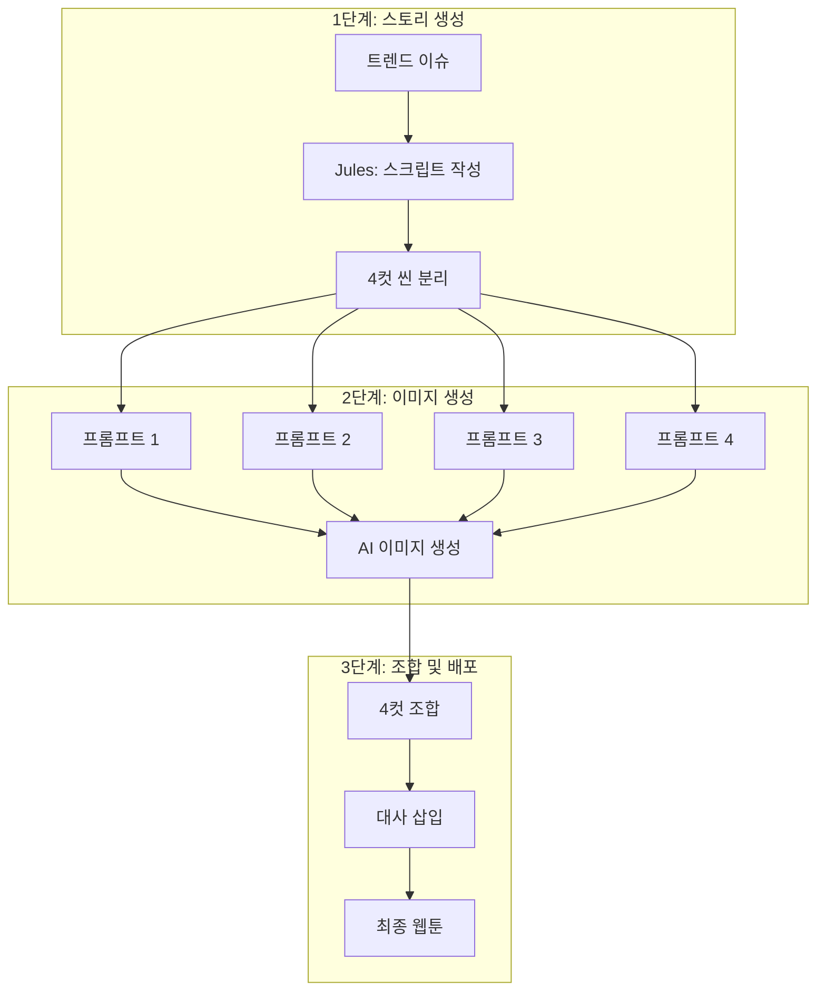

# TrendYummy 콘텐츠 자동 생성 시스템

## Implementation Plan (PLAN.md)

> **프로젝트 비전**: 매일 쏟아지는 최신 이슈(뉴스, 연예, 밈)를 소재로 즉각적인 웹 콘텐츠를 생산하는 자동화 시스템

> [!IMPORTANT]
> **우선순위 결정 (2026-01-13)**
> - 🥇 **심리/성격 테스트** 우선 개발
> - 🖼️ 이미지 생성: **나노바나나 (Nanobanana)** 사용
> - 🌐 배포 플랫폼: **웹 우선**, 이후 SNS 확장

---

## 1. 프로젝트 개요

### 1.1 시스템 목표



### 1.2 타겟 콘텐츠 카테고리

| 카테고리 | 콘텐츠 유형 | 예시 | 자동화 수준 | 우선순위 |
|---------|-----------|-----|-----------|--------|
| **심리/성격** | MBTI 테스트 | 최신 드라마 캐릭터 MBTI 테스트 | 🟢 높음 | 🥇 **1순위** |
| | 레벨 테스트 | 유행어 레벨 테스트 (IQ 테스트 변형) | 🟢 높음 | 🥇 **1순위** |
| **운세/궁합** | 연예인 궁합 | "핫한 연예인 커플과 나의 궁합은?" | 🟢 높음 | 🥈 2순위 |
| | AI 운세 | "AI가 짜주는 주말 데이트 코스 운세" | 🟢 높음 | 🥈 2순위 |
| **창작물** | 4컷 웹툰 | 실시간 이슈 기반 (나노바나나 이미지) | 🟡 중간 | 🥉 3순위 |
| | 풍자 시/소설 | 트렌드 기반 단편 창작 | 🟡 중간 |

---

## 2. 시스템 아키텍처

### 2.1 전체 시스템 구조



### 2.2 핵심 컴포넌트 정의

#### 2.2.1 트렌드 수집기 (Trend Collector)

```typescript
interface TrendItem {
  id: string;
  source: 'naver' | 'google' | 'twitter' | 'instagram' | 'youtube';
  category: 'news' | 'entertainment' | 'meme' | 'social';
  
  // 트렌드 정보
  keyword: string;
  title: string;
  description: string;
  relatedKeywords: string[];
  
  // 메타데이터
  trendScore: number;          // 0-100 화제성 점수
  sentimentScore: number;      // -1 to 1 감성 점수
  viralPotential: number;      // 바이럴 가능성
  
  // 소스 데이터
  sourceUrl: string;
  imageUrls: string[];
  relatedPersons: Person[];    // 관련 인물 (연예인, 정치인 등)
  
  // 타임스탬프
  detectedAt: Date;
  peakAt?: Date;
  expiresAt?: Date;
}

interface Person {
  name: string;
  type: 'celebrity' | 'politician' | 'influencer' | 'fictional';
  metadata: {
    mbti?: string;
    birthDate?: string;
    zodiacSign?: string;
    occupation?: string;
  };
}
```

#### 2.2.2 콘텐츠 타입별 생성 템플릿

```typescript
// 콘텐츠 유형별 정의
enum ContentType {
  MBTI_TEST = 'mbti_test',
  LEVEL_TEST = 'level_test',
  COMPATIBILITY = 'compatibility',
  FORTUNE = 'fortune',
  WEBTOON_4CUT = 'webtoon_4cut',
  SATIRE_POEM = 'satire_poem',
  SHORT_STORY = 'short_story'
}

interface ContentTemplate {
  type: ContentType;
  requiredTrendCategories: string[];
  minTrendScore: number;
  
  // 생성 설정
  generation: {
    promptTemplate: string;
    requiresImageGen: boolean;
    estimatedDuration: number;  // minutes
    requiredAssets: AssetType[];
  };
  
  // 출력 형식
  output: {
    format: 'html' | 'json' | 'markdown';
    schema: ContentSchema;
  };
}
```

---

## 3. 콘텐츠 타입별 상세 설계

### 3.1 심리/성격 테스트

#### MBTI 테스트 생성 파이프라인



#### MBTI 테스트 프롬프트 템플릿

```markdown
## Jules Prompt Template: MBTI 드라마 캐릭터 테스트

### 트렌드 정보
- 드라마명: {{drama_name}}
- 방영 플랫폼: {{platform}}
- 주요 캐릭터: {{characters}}
- 관련 키워드: {{keywords}}

### 생성 요청
1. **질문 생성** (12문항)
   - 드라마 상황에 기반한 시나리오형 질문
   - 각 질문당 4가지 선택지 (E/I, S/N, T/F, J/P 구분)
   
2. **결과 매핑** (16가지 MBTI)
   - 각 MBTI에 해당하는 드라마 캐릭터 매칭
   - 캐릭터 설명 및 명대사 포함
   
3. **추가 콘텐츠**
   - 궁합이 맞는 캐릭터 (3개)
   - 상극인 캐릭터 (1개)
   - 공유용 이미지 텍스트

### 출력 형식
- HTML + CSS (반응형)
- 결과 공유 기능 포함
- SEO 메타태그 포함
```

#### 레벨 테스트 (유행어/밈)

```typescript
interface LevelTestContent {
  title: string;           // "2024 유행어 레벨 테스트"
  subtitle: string;        // "당신은 몇 레벨?"
  
  questions: LevelQuestion[];
  levels: LevelResult[];
  
  metadata: {
    difficulty: 'easy' | 'medium' | 'hard';
    targetAge: string;
    trendPeriod: string;   // "2024년 1월"
  };
}

interface LevelQuestion {
  id: number;
  type: 'text' | 'image' | 'video';
  
  // 유행어/밈 문제
  question: string;        // "이 표현의 의미는?"
  hint?: string;
  imageUrl?: string;
  
  options: string[];
  correctAnswer: number;
  explanation: string;
  
  // 점수
  points: number;
  difficulty: number;
}

interface LevelResult {
  minScore: number;
  maxScore: number;
  level: string;           // "레벨 5: 트렌드 마스터"
  description: string;
  emoji: string;
  shareText: string;
}
```

---

### 3.2 운세/궁합 콘텐츠

#### 연예인 궁합 생성기



```typescript
interface CompatibilityContent {
  contentType: 'celebrity_compatibility';
  
  // 연예인 정보 (트렌드 기반)
  celebrity: {
    name: string;
    imageUrl: string;
    birthDate: string;
    mbti: string;
    zodiacSign: string;
    bloodType: string;
    occupation: string;
    
    // 현재 이슈
    currentNews: string;
    trendReason: string;
  };
  
  // 궁합 분석 결과 구조
  compatibilityResult: {
    overallScore: number;        // 0-100
    
    categories: {
      zodiac: { score: number; analysis: string };
      mbti: { score: number; analysis: string };
      bloodType: { score: number; analysis: string };
      numerology: { score: number; analysis: string };
    };
    
    strengths: string[];         // 잘 맞는 점
    challenges: string[];        // 주의할 점
    advice: string;              // 연애 조언
    
    // 공유용
    shareTitle: string;
    shareImage?: string;
  };
}
```

#### AI 데이트 코스 운세

```typescript
interface DateCourseFortuneContent {
  contentType: 'date_course_fortune';
  
  // 입력 기반
  userInput: {
    birthDate: string;
    currentMood: string;
    preferredStyle: 'active' | 'relaxed' | 'romantic' | 'adventurous';
    budget: 'low' | 'medium' | 'high';
    region?: string;
  };
  
  // 생성 결과
  dateCourse: {
    title: string;              // "당신만을 위한 로맨틱 데이트"
    fortuneMessage: string;     // 오늘의 운세 메시지
    
    timeline: DateSpot[];
    
    luckyItem: string;
    luckyColor: string;
    luckyTime: string;
    
    warningMessage?: string;    // 주의사항
  };
}

interface DateSpot {
  order: number;
  time: string;                 // "14:00"
  activity: string;             // "브런치 카페"
  reason: string;               // "오늘 금전운이 좋아 맛있는 음식을 권해요"
  tip: string;                  // "창가 자리를 예약하세요"
  estimatedCost: string;
}
```

---

### 3.3 창작물 콘텐츠

#### 4컷 웹툰 생성 파이프라인



```typescript
interface WebtoonContent {
  contentType: 'webtoon_4cut';
  
  // 트렌드 기반 정보
  baseTrend: {
    keyword: string;
    context: string;
    satireTone: 'light' | 'medium' | 'sharp';
  };
  
  // 4컷 스크립트
  script: {
    title: string;
    panels: Panel[];
    punchline: string;          // 마지막 컷의 핵심 펀치라인
  };
  
  // AI 이미지 프롬프트
  imagePrompts: {
    style: string;              // "만화 스타일, 한국 웹툰풍"
    characters: Character[];
    panelPrompts: PanelPrompt[];
  };
  
  // 최종 출력
  output: {
    combinedImageUrl: string;
    individualPanels: string[];
    altText: string;            // 접근성용
    shareCaption: string;
  };
}

interface Panel {
  number: 1 | 2 | 3 | 4;
  scene: string;                // 장면 설명
  dialogue: Dialogue[];
  emotion: string;              // 전체적인 분위기
}

interface Dialogue {
  character: string;
  text: string;
  type: 'speech' | 'thought' | 'narration';
}

interface PanelPrompt {
  panelNumber: number;
  prompt: string;               // DALL-E / Midjourney 프롬프트
  negativePrompt?: string;
}
```

#### 풍자 시/소설 생성

```typescript
interface SatireContent {
  contentType: 'satire_poem' | 'short_story';
  
  // 트렌드 컨텍스트
  trendContext: {
    mainTopic: string;
    relatedEvents: string[];
    targetAudience: string;
    satireAngle: string;        // 풍자 관점
  };
  
  // 시 콘텐츠
  poem?: {
    title: string;
    verses: string[];
    style: 'free' | 'rhyming' | 'haiku' | 'sonnet';
    tone: 'humorous' | 'critical' | 'absurd' | 'melancholic';
  };
  
  // 단편 소설
  shortStory?: {
    title: string;
    synopsis: string;
    content: string;            // 본문 (1000-3000자)
    genre: 'satire' | 'parody' | 'absurdist' | 'social_commentary';
  };
  
  // 메타데이터
  metadata: {
    readingTime: string;
    keywords: string[];
    disclaimer?: string;        // 풍자임을 명시
  };
}
```

---

## 4. Jules 세션 구성

### 4.1 세션 유형별 분류

| 세션 그룹 | 할당 세션 수 | 역할 | 우선순위 |
|----------|------------|-----|---------|
| **트렌드 분석** | 10 | 실시간 트렌드 모니터링 및 분류 | HIGH |
| **심리 테스트** | 25 | MBTI/레벨 테스트 생성 | HIGH |
| **운세 콘텐츠** | 20 | 궁합/운세 콘텐츠 생성 | MEDIUM |
| **웹툰 스크립트** | 15 | 4컷 스크립트 + 이미지 프롬프트 | MEDIUM |
| **문학 창작** | 15 | 풍자 시/소설 생성 | LOW |
| **품질 검증** | 10 | 생성된 콘텐츠 검토 | HIGH |
| **백업/유지보수** | 5 | 장애 복구, 재생성 | LOW |
| **합계** | 100 | | |

### 4.2 세션 작업 정의

```typescript
// 콘텐츠 유형별 Task Definition 확장
interface TrendYummyTask extends TaskDefinition {
  // 콘텐츠 특화 필드
  contentSpec: {
    type: ContentType;
    trend: TrendItem;
    template: ContentTemplate;
    
    // 트렌드 활용 설정
    trendUsage: {
      primaryKeyword: string;
      contextKeywords: string[];
      persons: Person[];
      timeRelevance: 'realtime' | 'daily' | 'weekly';
    };
  };
  
  // 품질 요구사항
  qualityRequirements: {
    minScore: number;           // 최소 품질 점수
    requireHumanReview: boolean;
    sensitiveTopicCheck: boolean;
  };
  
  // 배포 설정
  publishSettings: {
    autoPublish: boolean;
    scheduledTime?: Date;
    targetPlatforms: Platform[];
  };
}

enum Platform {
  WEB = 'web',
  INSTAGRAM = 'instagram',
  TWITTER = 'twitter',
  KAKAO = 'kakao'
}
```

---

## 5. 기술 스택 및 인프라

### 5.1 기술 스택

```
┌─────────────────────────────────────────────────────────────┐
│                      Frontend                                │
│  Next.js 14 + TypeScript + Tailwind CSS                     │
│  React Query + Zustand                                       │
└─────────────────────────────────────────────────────────────┘
                              │
┌─────────────────────────────────────────────────────────────┐
│                      Backend API                             │
│  Node.js + Express/Fastify + TypeScript                     │
│  GraphQL (Apollo) + REST API                                │
└─────────────────────────────────────────────────────────────┘
                              │
┌─────────────────────────────────────────────────────────────┐
│                   Orchestration Layer                        │
│  Session Orchestrator (TECHSPEC 기반)                        │
│  Bull Queue (Redis) + PostgreSQL                            │
└─────────────────────────────────────────────────────────────┘
                              │
┌─────────────────────────────────────────────────────────────┐
│                   AI Services                                │
│  Jules API          │ 나노바나나          │ 분석 서비스      │
│  (코드/콘텐츠 생성)  │ (Gemini Image API)│ (감성/트렌드)    │
└─────────────────────────────────────────────────────────────┘
                              │
┌─────────────────────────────────────────────────────────────┐
│                   Data Collection                            │
│  Puppeteer Cluster  │ News API          │ Social Media API  │
│  (웹 크롤링)         │ (뉴스 수집)        │ (SNS 트렌드)      │
└─────────────────────────────────────────────────────────────┘
                              │
┌─────────────────────────────────────────────────────────────┐
│                   Infrastructure                             │
│  PostgreSQL + Redis + S3/R2 + CloudFlare CDN                │
│  Docker + Kubernetes (Optional)                             │
└─────────────────────────────────────────────────────────────┘
```

### 5.2 외부 API 의존성

| 서비스 | 용도 | 예상 비용 |
|-------|-----|--------|
| **Jules Ultra** | 콘텐츠 생성 (100 세션) | $50+/월 |
| **나노바나나 (Nanobanana)** | 웹툰/테스트 이미지 생성 | Gemini API 기반 |
| ↳ Gemini 2.5 Flash Image | 빠른 이미지 생성 | ~$0.02/이미지 |
| ↳ Gemini 3 Pro Image | 고품질 4K 이미지 | ~$0.04/이미지 |
| **Naver Search API** | 국내 트렌드/뉴스 | 무료 (한도 내) |
| **Google Trends** | 글로벌 트렌드 | 무료 |
| **Twitter API** | 실시간 밈/화제 | $100/월 (Basic) |
| **Cloudflare R2** | 이미지 저장 | ~$15/TB |

> [!TIP]
> **나노바나나 선택 이유**
> - 한국어 프롬프트 네이티브 지원
> - Gemini 기반으로 최대 4K 해상도
> - 캐릭터 일관성 유지 기능 (웹툰에 적합)
> - Google AI Studio / Vertex AI 통해 API 접근

---

## 6. 구현 로드맵

### Phase 1: 기초 인프라 (Week 1-2)

```
[ ] 프로젝트 셋업
    [ ] Next.js + TypeScript 프로젝트 초기화
    [ ] PostgreSQL + Redis 설정
    [ ] Jules API 연동 (TECHSPEC 기반)
    [ ] GitHub 레포지토리 구조 설정

[ ] 트렌드 수집 시스템
    [ ] 네이버 실검/뉴스 크롤러
    [ ] 트렌드 분석 및 저장 로직
    [ ] 스케줄러 (매 시간 수집)
```

### Phase 2: 콘텐츠 생성 엔진 (Week 3-5)

```
[ ] Jules 세션 오케스트레이터
    [ ] TECHSPEC 기반 SessionOrchestrator 구현
    [ ] 콘텐츠 타입별 Task 정의
    [ ] 자동 세션 배정 로직

[ ] 콘텐츠 생성 모듈
    [ ] MBTI 테스트 생성기
    [ ] 레벨 테스트 생성기
    [ ] 운세/궁합 생성기
    [ ] 웹툰 스크립트 생성기
```

### Phase 3: AI 이미지 통합 (Week 6-7)

```
[ ] 이미지 생성 파이프라인
    [ ] 나노바나나 (Gemini Image API) 통합
    [ ] 한국어 프롬프트 최적화
    [ ] 이미지 후처리 (4컷 조합)
    
[ ] 에셋 관리
    [ ] 이미지 저장 (Cloudflare R2)
    [ ] CDN 배포 설정
```

### Phase 4: 프론트엔드 & 배포 (Week 8-10)

```
[ ] 웹 프론트엔드
    [ ] 테스트 플레이 UI
    [ ] 결과 공유 기능
    [ ] 반응형 디자인

[ ] 관리 대시보드
    [ ] 콘텐츠 현황 모니터링
    [ ] 수동 승인/편집 기능
    [ ] 통계 및 분석
```

### Phase 5: 최적화 & 운영 (Week 11-12)

```
[ ] 품질 개선
    [ ] 콘텐츠 품질 점수 시스템
    [ ] A/B 테스트 프레임워크
    [ ] 사용자 피드백 수집

[ ] 운영 자동화
    [ ] 알림 시스템 (Slack/Discord)
    [ ] 장애 자동 복구
    [ ] 일일/주간 리포트
```

---

## 7. 검증 계획 (Verification Plan)

### 7.1 자동화 테스트

```bash
# 단위 테스트
npm run test:unit

# 통합 테스트 (API)
npm run test:integration

# E2E 테스트 (콘텐츠 생성 플로우)
npm run test:e2e
```

### 7.2 품질 검증 체크리스트

| 검증 항목 | 방법 | 합격 기준 |
|----------|-----|---------|
| 콘텐츠 생성 속도 | 자동 측정 | < 5분/콘텐츠 |
| 콘텐츠 품질 점수 | AI 평가 + 수동 샘플링 | > 80점 |
| 트렌드 반영 정확도 | 키워드 매칭 검증 | > 90% |
| 이미지 생성 성공률 | 로그 분석 | > 95% |
| 시스템 가용성 | 모니터링 | > 99.5% |

### 7.3 수동 테스트

1. **MBTI 테스트 생성 검증**
   - 새 드라마 트렌드 입력
   - 생성된 12문항 적절성 확인
   - 16개 결과 캐릭터 매칭 검증
   - 모바일/PC 반응형 확인

2. **4컷 웹툰 품질 검증**
   - 풍자 적절성 확인
   - 이미지 일관성 검토
   - 텍스트 가독성 확인

---

## 8. 리스크 관리

| 리스크 | 영향도 | 대응 방안 |
|-------|-------|---------|
| Jules API 사용량 초과 | 높음 | 우선순위 기반 세션 관리 |
| 민감한 주제 생성 | 높음 | 필터링 + 수동 검토 |
| 이미지 생성 실패 | 중간 | 대체 이미지 풀 준비 |
| 트렌드 급변 | 중간 | 실시간 모니터링 강화 |
| 저작권 이슈 | 높음 | 출처 명시 + 패러디 면책 |

---

## 9. 확장 로드맵

### 단기 (3개월)
- 핵심 콘텐츠 타입 4종 자동화 완료
- 일 50개 이상 콘텐츠 생산

### 중기 (6개월)
- 다국어 지원 (영어, 일본어)
- 플랫폼별 최적화 (인스타그램, 트위터)

### 장기 (12개월)
- 사용자 생성 콘텐츠 (UGC) 지원
- 실시간 라이브 콘텐츠 생성
- 수익화 모델 도입

---

## 참고 문서

- [TECHSPEC.md](file:///d:/Work/AntigravityProjects/TrendYummy/TECHSPEC.md) - Jules 세션 관리 기술 명세
