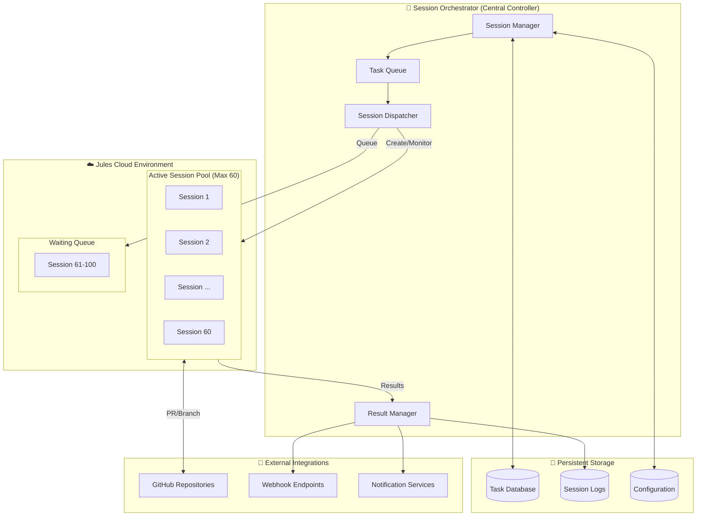
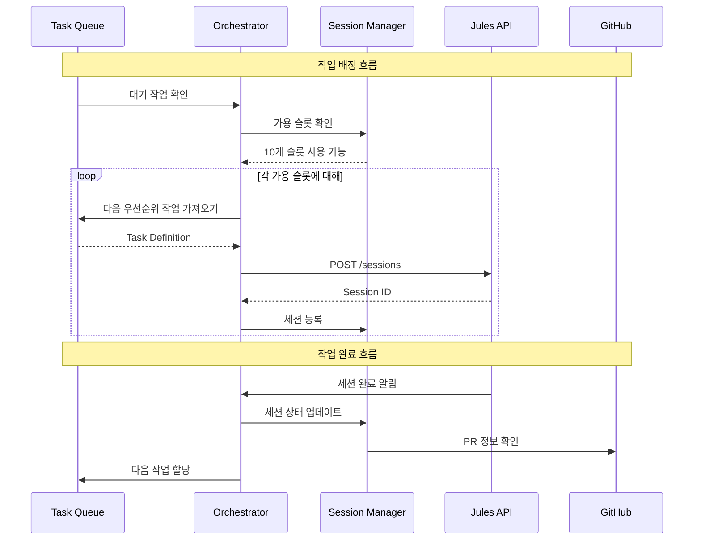
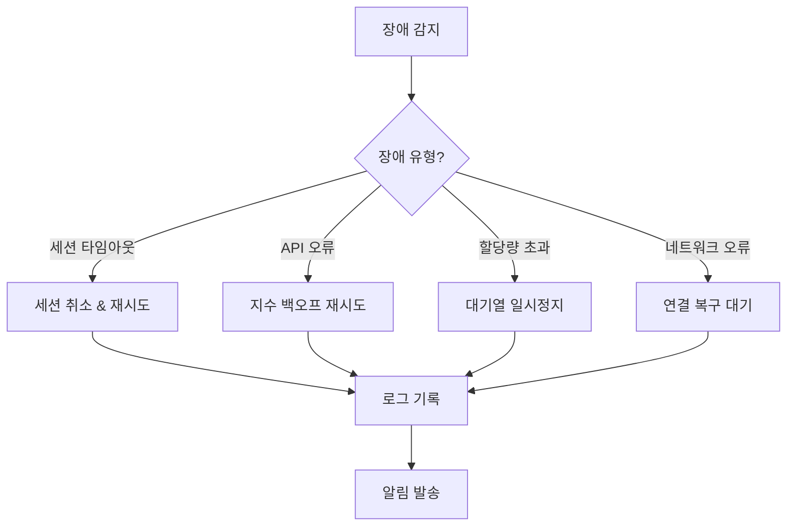

# Jules Multi-Session Management System

## Technical Specification Document (TECHSPEC)

> **목적**: Google Jules AI 코딩 에이전트를 활용하여 100개의 세션을 동시에 관리하고, 각 세션에 목표와 작업을 할당하여 반복적인 작업을 수행하는 자동화 시스템

---

## 1. 개요 (Overview)

### 1.1 시스템 목표
- **100개 세션 관리**: Jules Ultra 플랜(60개 동시 작업) 기반으로 100개의 개별 세션을 효율적으로 관리
- **목표/일감 할당**: 각 세션에 특정 목표(Goal)와 작업(Task)을 동적으로 배정
- **반복 실행**: 작업 완료 후 자동으로 다음 작업을 할당하여 지속적인 작업 수행
- **중앙 집중 관리**: 모든 세션의 상태, 진행률, 결과를 통합 모니터링

### 1.2 Jules 플랜별 한계
| 플랜 | 동시 작업 수 | 일일 사용량 | 적합한 시나리오 |
|------|-------------|-------------|----------------|
| Free | 3 | 제한적 | 테스트/프로토타입 |
| Pro | 15 | 중간 | 소규모 팀 |
| **Ultra** | **60** | 대용량 | **100개 세션 관리 (필수)** |

> [!IMPORTANT]
> 100개의 세션을 관리하려면 **Jules Ultra 플랜**이 필수입니다.
> 동시 실행 가능한 세션은 60개이므로, 40개 세션은 대기열에서 관리됩니다.

---

## 2. 시스템 아키텍처 (System Architecture)

### 2.1 아키텍처 다이어그램



### 2.2 핵심 컴포넌트

#### 2.2.1 Session Orchestrator (세션 오케스트레이터)
중앙 제어 시스템으로 모든 Jules 세션의 라이프사이클을 관리합니다.

| 컴포넌트 | 역할 |
|---------|-----|
| **Session Manager** | 세션 생성, 상태 추적, 재시도 로직 관리 |
| **Task Queue** | 대기 중인 작업들의 우선순위 기반 대기열 |
| **Session Dispatcher** | 사용 가능한 Jules 슬롯에 작업 배정 |
| **Result Manager** | 완료된 작업 결과 수집 및 처리 |

#### 2.2.2 Task Definition (작업 정의)
각 세션에 할당되는 작업의 구조:

```typescript
interface TaskDefinition {
  id: string;                    // 고유 작업 ID
  sessionId?: string;            // 할당된 Jules 세션 ID
  
  // 목표 정의
  goal: {
    title: string;              // 작업 제목
    description: string;        // 상세 설명
    category: TaskCategory;     // 작업 유형
  };
  
  // Jules 실행 설정
  execution: {
    repository: string;         // 대상 GitHub 레포지토리
    branch?: string;            // 작업 브랜치 (기본: 자동 생성)
    prompt: string;             // Jules에게 전달할 상세 프롬프트
    requirePlanApproval: boolean; // 계획 승인 필요 여부
    automationMode: 'AUTO_CREATE_PR' | 'MANUAL';
  };
  
  // 관리 정보
  management: {
    priority: Priority;         // 우선순위 (HIGH, MEDIUM, LOW)
    maxRetries: number;         // 최대 재시도 횟수
    timeout: number;            // 타임아웃 (ms)
    dependencies?: string[];    // 선행 작업 ID들
  };
  
  // 상태 추적
  status: TaskStatus;
  createdAt: Date;
  updatedAt: Date;
  completedAt?: Date;
  result?: TaskResult;
}

enum TaskCategory {
  BUG_FIX = 'bug_fix',
  FEATURE = 'feature',
  REFACTOR = 'refactor',
  TEST = 'test',
  DEPENDENCY_UPDATE = 'dependency_update',
  DOCUMENTATION = 'documentation'
}

enum TaskStatus {
  PENDING = 'pending',           // 대기열에서 대기 중
  QUEUED = 'queued',             // 세션 할당 대기
  IN_PROGRESS = 'in_progress',   // 실행 중
  PLAN_REVIEW = 'plan_review',   // 계획 검토 대기
  COMPLETED = 'completed',       // 완료
  FAILED = 'failed',             // 실패
  CANCELLED = 'cancelled'        // 취소됨
}
```

---

## 3. Jules API 통합 (API Integration)

### 3.1 REST API 엔드포인트

Jules REST API (`https://jules.googleapis.com/v1alpha`)를 사용하여 세션을 관리합니다.

| 작업 | HTTP Method | Endpoint | 설명 |
|-----|-------------|----------|-----|
| 세션 생성 | `POST` | `/sessions` | 새 Jules 세션 생성 |
| 세션 목록 | `GET` | `/sessions` | 모든 세션 조회 |
| 세션 상세 | `GET` | `/sessions/{sessionId}` | 특정 세션 상태 조회 |
| 세션 삭제 | `DELETE` | `/sessions/{sessionId}` | 세션 종료/삭제 |

### 3.2 세션 생성 API 요청 예시

```javascript
// Session Creation Request
const createSession = async (task: TaskDefinition) => {
  const response = await fetch('https://jules.googleapis.com/v1alpha/sessions', {
    method: 'POST',
    headers: {
      'Authorization': `Bearer ${API_KEY}`,
      'Content-Type': 'application/json'
    },
    body: JSON.stringify({
      title: task.goal.title,
      prompt: task.execution.prompt,
      sourceContext: {
        repository: task.execution.repository,
        branch: task.execution.branch || 'main'
      },
      requirePlanApproval: task.execution.requirePlanApproval,
      automationMode: task.execution.automationMode
    })
  });
  
  return response.json();
};
```

### 3.3 CLI 병렬 실행

```bash
# Jules CLI를 사용한 병렬 세션 시작
jules remote new \
  --repo "owner/repo" \
  --parallel 10 \
  --session "feature-implementation"
```

---

## 4. 오케스트레이션 전략 (Orchestration Strategies)

### 4.1 권장 패턴: Orchestrator-Worker + Queue

100개 세션 관리에 가장 적합한 아키텍처 패턴입니다.



### 4.2 세션 풀 관리 전략

#### Active Pool (최대 60개)
- 현재 Jules Cloud에서 실행 중인 세션
- 실시간 상태 모니터링 (Polling: 30초 간격)
- 타임아웃 및 실패 감지

#### Waiting Queue (41번째~100번째)
- 우선순위 기반 대기열 (Redis/PostgreSQL)
- Active Pool에 빈 슬롯 발생 시 자동 배정
- 예상 대기 시간 계산

---

## 5. 데이터베이스 스키마 (Database Schema)

### 5.1 PostgreSQL 스키마

```sql
-- 작업 테이블
CREATE TABLE tasks (
    id UUID PRIMARY KEY DEFAULT gen_random_uuid(),
    goal_title VARCHAR(255) NOT NULL,
    goal_description TEXT,
    category VARCHAR(50) NOT NULL,
    
    -- 실행 설정
    repository VARCHAR(255) NOT NULL,
    branch VARCHAR(100),
    prompt TEXT NOT NULL,
    require_plan_approval BOOLEAN DEFAULT true,
    automation_mode VARCHAR(50) DEFAULT 'AUTO_CREATE_PR',
    
    -- 관리
    priority INTEGER DEFAULT 5,
    max_retries INTEGER DEFAULT 3,
    retry_count INTEGER DEFAULT 0,
    timeout_ms BIGINT DEFAULT 3600000,
    
    -- 상태
    status VARCHAR(50) DEFAULT 'pending',
    session_id VARCHAR(100),
    
    -- 타임스탬프
    created_at TIMESTAMP DEFAULT NOW(),
    updated_at TIMESTAMP DEFAULT NOW(),
    started_at TIMESTAMP,
    completed_at TIMESTAMP,
    
    -- 결과
    result JSONB,
    error_message TEXT,
    pull_request_url VARCHAR(500)
);

-- 세션 테이블
CREATE TABLE sessions (
    id VARCHAR(100) PRIMARY KEY,
    task_id UUID REFERENCES tasks(id),
    status VARCHAR(50) NOT NULL,
    
    created_at TIMESTAMP DEFAULT NOW(),
    updated_at TIMESTAMP DEFAULT NOW(),
    
    -- Jules 세션 메타데이터
    metadata JSONB
);

-- 실행 로그 테이블
CREATE TABLE execution_logs (
    id UUID PRIMARY KEY DEFAULT gen_random_uuid(),
    task_id UUID REFERENCES tasks(id),
    session_id VARCHAR(100),
    
    event_type VARCHAR(50) NOT NULL,
    event_data JSONB,
    created_at TIMESTAMP DEFAULT NOW()
);

-- 인덱스
CREATE INDEX idx_tasks_status ON tasks(status);
CREATE INDEX idx_tasks_priority ON tasks(priority DESC);
CREATE INDEX idx_sessions_task ON sessions(task_id);
```

---

## 6. 구현 로드맵 (Implementation Roadmap)

### Phase 1: Core Infrastructure (Week 1-2)

```
[ ] 프로젝트 초기 설정
    [ ] Node.js/TypeScript 프로젝트 생성
    [ ] PostgreSQL 데이터베이스 설정
    [ ] Jules API 인증 및 연결 테스트

[ ] 기본 컴포넌트 구현
    [ ] TaskQueue 클래스 (우선순위 큐)
    [ ] SessionManager 클래스
    [ ] JulesApiClient 클래스
```

### Phase 2: Orchestration Logic (Week 3-4)

```
[ ] 오케스트레이터 구현
    [ ] SessionDispatcher (세션 배정 로직)
    [ ] ResultManager (결과 수집)
    [ ] HealthChecker (상태 모니터링)

[ ] 재시도 및 복구 로직
    [ ] 자동 재시도 메커니즘
    [ ] 장애 복구 전략
```

### Phase 3: Monitoring & UI (Week 5-6)

```
[ ] 모니터링 시스템
    [ ] 실시간 대시보드 (WebSocket)
    [ ] 알림 시스템 (Slack/Discord/Email)
    [ ] 로그 집계 및 분석

[ ] 관리 API & UI
    [ ] REST API for 작업 관리
    [ ] 웹 대시보드 UI
    [ ] 벌크 작업 관리
```

---

## 7. 핵심 코드 예시 (Code Examples)

### 7.1 Session Orchestrator

```typescript
// src/orchestrator/SessionOrchestrator.ts
import { JulesApiClient } from './JulesApiClient';
import { TaskQueue } from './TaskQueue';
import { SessionManager } from './SessionManager';

export class SessionOrchestrator {
  private readonly MAX_CONCURRENT_SESSIONS = 60;
  private readonly POLL_INTERVAL_MS = 30000;
  
  private julesApi: JulesApiClient;
  private taskQueue: TaskQueue;
  private sessionManager: SessionManager;
  
  constructor(config: OrchestratorConfig) {
    this.julesApi = new JulesApiClient(config.apiKey);
    this.taskQueue = new TaskQueue(config.database);
    this.sessionManager = new SessionManager(config.database);
  }
  
  async start(): Promise<void> {
    console.log('🚀 Session Orchestrator starting...');
    
    // 메인 루프 시작
    this.runDispatchLoop();
    this.runMonitorLoop();
  }
  
  private async runDispatchLoop(): Promise<void> {
    setInterval(async () => {
      const availableSlots = this.MAX_CONCURRENT_SESSIONS 
        - await this.sessionManager.getActiveCount();
      
      if (availableSlots <= 0) return;
      
      // 가용 슬롯만큼 작업 배정
      const tasks = await this.taskQueue.getNextTasks(availableSlots);
      
      for (const task of tasks) {
        try {
          const session = await this.julesApi.createSession({
            title: task.goal.title,
            prompt: task.execution.prompt,
            sourceContext: {
              repository: task.execution.repository,
              branch: task.execution.branch
            },
            requirePlanApproval: task.execution.requirePlanApproval,
            automationMode: task.execution.automationMode
          });
          
          await this.sessionManager.register(session.id, task.id);
          await this.taskQueue.updateStatus(task.id, 'in_progress');
          
          console.log(`✅ Task ${task.id} → Session ${session.id}`);
        } catch (error) {
          console.error(`❌ Failed to dispatch task ${task.id}:`, error);
          await this.taskQueue.handleFailure(task.id, error);
        }
      }
    }, this.POLL_INTERVAL_MS);
  }
  
  private async runMonitorLoop(): Promise<void> {
    setInterval(async () => {
      const activeSessions = await this.sessionManager.getActiveSessions();
      
      for (const session of activeSessions) {
        try {
          const status = await this.julesApi.getSession(session.id);
          
          if (status.state === 'COMPLETED') {
            await this.handleSessionComplete(session, status);
          } else if (status.state === 'FAILED') {
            await this.handleSessionFailure(session, status);
          }
        } catch (error) {
          console.error(`Monitor error for session ${session.id}:`, error);
        }
      }
    }, this.POLL_INTERVAL_MS);
  }
  
  private async handleSessionComplete(session: Session, status: any): Promise<void> {
    await this.taskQueue.markCompleted(session.taskId, {
      pullRequestUrl: status.pullRequestUrl,
      summary: status.summary
    });
    
    await this.sessionManager.release(session.id);
    console.log(`🎉 Session ${session.id} completed successfully`);
  }
  
  private async handleSessionFailure(session: Session, status: any): Promise<void> {
    const task = await this.taskQueue.getTask(session.taskId);
    
    if (task.retry_count < task.max_retries) {
      // 재시도
      await this.taskQueue.requeueForRetry(session.taskId);
    } else {
      // 최종 실패 처리
      await this.taskQueue.markFailed(session.taskId, status.error);
    }
    
    await this.sessionManager.release(session.id);
  }
}
```

### 7.2 대시보드 API

```typescript
// src/api/routes/tasks.ts
import { Router } from 'express';
import { TaskQueue } from '../orchestrator/TaskQueue';

const router = Router();

// 작업 생성 (벌크 지원)
router.post('/tasks', async (req, res) => {
  const { tasks } = req.body; // TaskDefinition[]
  
  const createdTasks = await taskQueue.bulkCreate(tasks);
  res.json({ 
    success: true, 
    count: createdTasks.length,
    ids: createdTasks.map(t => t.id)
  });
});

// 전체 상태 조회
router.get('/tasks/status', async (req, res) => {
  const summary = await taskQueue.getSummary();
  res.json({
    total: summary.total,
    pending: summary.pending,
    inProgress: summary.inProgress,
    completed: summary.completed,
    failed: summary.failed,
    activeSessions: summary.activeSessions,
    queuedSessions: summary.total - summary.completed - summary.failed - summary.activeSessions
  });
});

// 특정 작업 상세
router.get('/tasks/:id', async (req, res) => {
  const task = await taskQueue.getTask(req.params.id);
  res.json(task);
});

export default router;
```

---

## 8. 운영 가이드라인 (Operational Guidelines)

### 8.1 비용 추정

| 항목 | 수량 | 예상 비용 |
|-----|-----|---------|
| Jules Ultra 플랜 | 1 | $50+/월 (예상) |
| PostgreSQL 호스팅 | 1 | $20-50/월 |
| 서버 (Orchestrator) | 1 | $10-30/월 |
| **월간 총 비용** | | **$80-130+/월** |

### 8.2 모니터링 지표

| 지표 | 설명 | 알림 임계값 |
|-----|-----|-----------|
| Active Sessions | 현재 실행 중인 세션 수 | < 50% 활용률 |
| Queue Depth | 대기열 깊이 | > 100개 작업 |
| Success Rate | 작업 성공률 | < 80% |
| Avg Duration | 평균 작업 시간 | > 2시간 |

### 8.3 장애 대응



---

## 9. 확장 고려사항 (Scalability Considerations)

### 9.1 다중 레포지토리 지원
- 레포지토리별 작업 풀 분리
- 레포지토리 우선순위 가중치

### 9.2 작업 의존성 관리
- DAG(Directed Acyclic Graph) 기반 의존성 해결
- 선행 작업 완료 대기

### 9.3 동적 우선순위 조정
- 대기 시간에 따른 우선순위 상승
- 긴급 작업 인터럽트

---

## 10. 보안 고려사항 (Security Considerations)

- **API 키 관리**: 환경 변수 또는 Secret Manager 사용
- **레포지토리 접근 권한**: 최소 권한 원칙 적용
- **감사 로그**: 모든 세션 생성/삭제 기록
- **프롬프트 인젝션 방지**: 입력 검증 및 제한

---

## 참고 자료 (References)

- [Jules 공식 문서](https://jules.google)
- [Jules REST API](https://jules.googleapis.com/v1alpha)
- [Jules CLI 문서](https://jules.google/docs/cli)
- [Multi-Agent Orchestration Patterns](https://microsoft.com)
